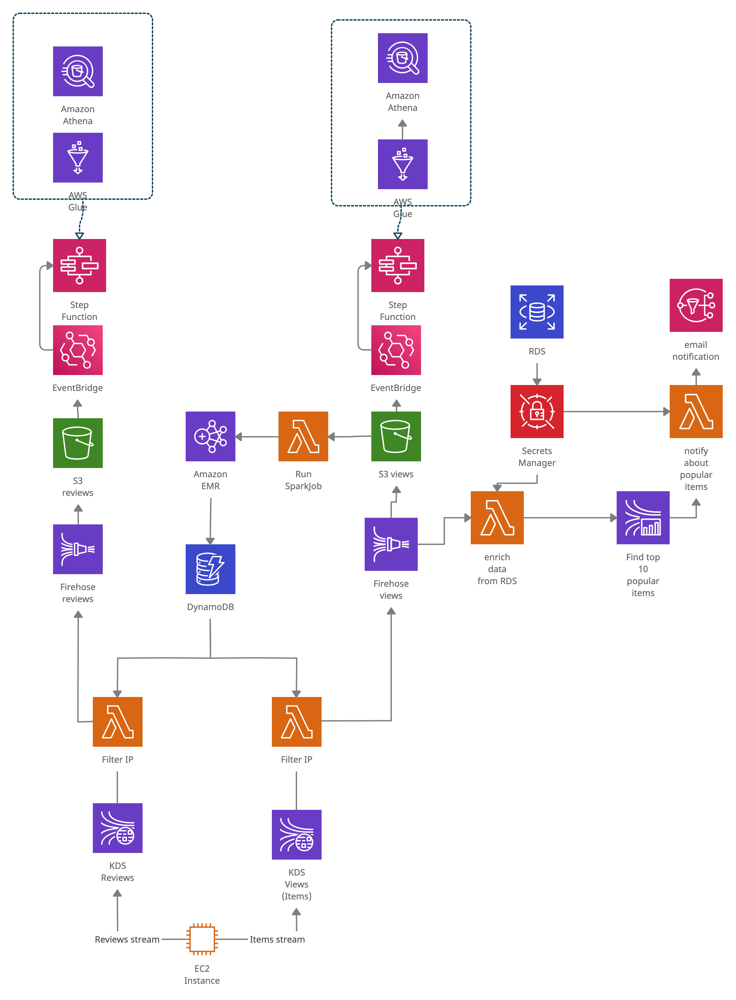

# Repository with a capstone project of the AWS Big Data Course

This repository contains the following files:

```
├── auxiliary                       
│   ├── generator.py                <- streams generator
│   ├── requirements.txt            <- requirements for the streams generator
│   ├── install_boto3.sh            <- sh script for the bootstarping process in a EMR cluster
│   ├── items.csv                   <- human-readable description of items 
│   └── spark-job.py                <- spark job to find spam ips
│
├── cloudformation.yaml             <- main cloudformation script
├── cloudformation_update.yaml      <- second step of the process of cloudfromation 
│                                      to resolve a circular dependency between S3 Notification and Lambda 
│                                      according to official AWS support recomendation^ 
├── form_infrastructure.sh          <- main bash script for creating the infrastructure
├── infrastructure.jpg              <- general representation of the final result
└── README.md
```

^[AWS support recomendation](https://aws.amazon.com/premiumsupport/knowledge-center/unable-validate-circular-dependency-cloudformation)

## Usage

Clone the repository to your local machine. cd to the directory with the repository.
To get started with the project, make sure you have installed and configured aws cli and then run the following command:
```shell
    bash form_infrastructure.sh stack_name={your_stack_name}
```

Wait for a few minutes and you should be able to access all resources in AWS Console.

Additional information: 
To start streaming data, you need to go to the EC2 instance, edit the generator script in the home folder, changing the names of the data streams, then run the script with the command:
```shell
    python3 generator.py stream items
```
or
```shell
    python3 generator.py stream reviews
```

## General representation of the final result

